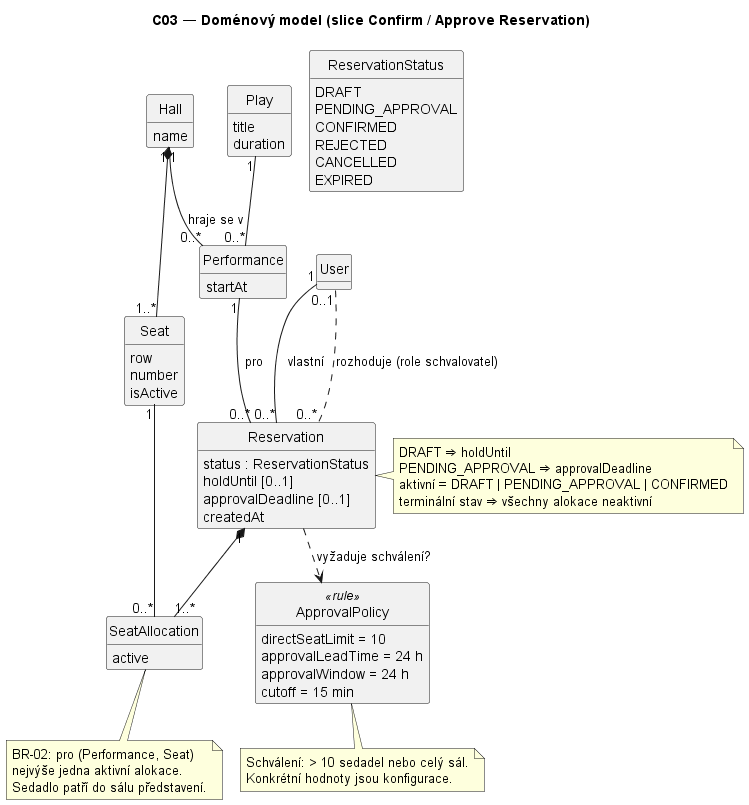

# Architektura a rozhodnutí

## Technologický stack

- **Jazyk:** Python 3
- **Framework:** Django 6.1
- **Databáze:** SQLite (vývojové prostředí) — přes Django ORM
- **Testování:** vestavěný Django `TestCase` (`python manage.py test`)

## Struktura projektu

Jeden Django projekt `rezervace_divadlo` s jednou aplikací: `reservation`.


## Doménový model

Aplikace `reservation` definuje pět doménových modelů a model alokace sedadel:

- **Play** — divadelní hra (název, popis, délka trvání)
- **Hall** — fyzický prostor/sál
- **Seat** — patří k `Hall`; unikátní podle kombinace `(hall, row, number)`
  a obsahuje příznak `is_active`.
- **Performance** — konkrétní uvedení `Play` v daném `Hall` v daný čas (`start_at`)
- **Reservation** — reprezentuje jednu rezervaci pro konkrétní `Performance` a
	může obsahovat jedno nebo více vybraných `Seat`. Jedno sedadlo nesmí být pro
	stejné představení součástí více aktivních rezervací. Rezervace používá
	stavy `DRAFT`, `PENDING_APPROVAL`, `CONFIRMED`, `CANCELLED`, `REJECTED` a
	`EXPIRED`. Aktivní `DRAFT` drží všechna vybraná sedadla po dobu
	`hold_until`; `PENDING_APPROVAL` je blokuje do rozhodnutí nebo vypršení;
	`CONFIRMED` je blokuje trvale pro dané představení; `CANCELLED`,
	`REJECTED` a `EXPIRED` sedadla neblokují.
- **ReservationSeat** — vazba rezervace na sedadlo a představení. Uchovává
  historii sedadel; příznak `active` odlišuje aktuální blokování. Podmíněný
  unikátní constraint dovolí pouze jednu aktivní alokaci pro `(performance, seat)`.

Uživatel nejdříve zobrazí sál a vybere jedno nebo více sedadel. Teprve po
stisku tlačítka pro pokračování s rezervací vznikne jedna `Reservation` pro
všechna vybraná sedadla. Rezervace pro více než deset sedadel je hromadná a
vyžaduje schválení oprávněnou osobou. Rezervace celého sálu schválení vyžaduje
bez ohledu na počet sedadel.


## Klíčová rozhodnutí

| Rozhodnutí | Zdůvodnění |
|---|---|
| Použít Django + Django ORM místo samostatné persistentní vrstvy | Nejrychlejší cesta k funkčnímu a testovatelnému doménovému modelu pro C01; migrace a constrainty v ORM pokrývají naše aktuální potřeby (unikátnostní pravidla) bez nutnosti dalších nástrojů. |
| Použít SQLite pro vývoj | Nulové nastavení, dostatečné pro ověření doménové logiky a spouštění testů lokálně/v CI. Přehodnotíme pro CP1, pokud budeme potřebovat garance pro souběžné zápisy (viz future pressure: 20× souběžných rezervací). |
| Vynutit exkluzivitu podmíněným unikátním constraintem na `ReservationSeat` | Databáze odmítne druhou aktivní alokaci stejného sedadla a představení. Zrušení, zamítnutí a expirace vypnou alokace, ale zachovají historii. Všechny aplikační zápisy procházejí `services.py` v transakci. SQLite používá `BEGIN IMMEDIATE`; zámek spisovatele vzniká před čtením dostupnosti. |
| Jedna Django aplikace (`reservation`) místo rozdělení modelů do více aplikací | Doména je zatím malá (5 modelů); rozdělování by teď přidalo strukturu bez reálného přínosu. Přehodnotíme, pokud aplikace výrazně naroste. |

## Umístění business logiky

`reservation/services.py` obsahuje OP-01 až OP-05, obnovu aktivity a expiraci.
Modely popisují data a databázová omezení. Testy v `reservation/tests.py`
volají služby přímo; reservation nemá HTTP API. `notifications.py` je lokální adaptér
Notification Service, volaný až po potvrzení transakce.

`expire_reservations --watch` zajišťuje časovač. I při jeho zpoždění služby
odmítnou operaci po deadline a dostupnost ignoruje vypršené držení bez
změny stavu. Pro pravidelné přepisování stavu do `EXPIRED` musí časovač běžet.

## Známá omezení (stav k C02)

- Notification Service zatím pouze zapisuje události do lokálního logu;
  externí doručování a jeho retry nejsou implementované.
- SQLite serializuje všechny spisovatele. Současná jednoduchá sada testuje
  hraniční případy sekvenčně; neověřuje paralelní zápisy ani produkční výkon.
- Záznamy C01 migrace zachová jako `CONFIRMED` bez známého vlastníka;
  spravovat je smí uživatel s oprávněním `change_reservation`.
- Návrat migrace více sedadel na původní jednosedadlový model je záměrně
  nepodporovaný, protože by mohl ztratit historii. Před migrací existující
  databáze je třeba zachovat její zálohu.
- Přímé změny stavů či alokací přes ORM obcházejí pravidla služeb;
  aplikace používá pro všechny business operace `services.py`.

## C03 - současná realizace Confirm Reservation

### Sledovaný scénář

| Položka | Hodnota |
|---|---|
| Operace | OP-03 — Confirm Reservation |
| Požadavky | REQ-03, REQ-04 — [operations.md](operations.md) |
| Pravidla | BR-02, BR-04, BR-06, BR-07, BR-08 — [intent_and_change.md](intent_and_change.md) |
| Baseline | v0.2 — [evidence-and-evolution.md](evidence-and-evolution.md) |

Doklady níže uvádějí soubor a funkci/model. [Testy](../src/rezervace_divadlo/reservation/tests.py) byly přečteny, nově se nespouštěly.

### Hlavní průchod scénáře → kód

| Krok scénáře z C02 | Realizace v kódu | Doklad |
|---|---|---|
| Přijmout požadavek a načíst rezervaci. | Přímé volání služby; načtení rezervace a představení v transakci. | [services.py][services]: `confirm_reservation`, `_reservation`, `_atomic_operation` |
| Ověřit oprávnění a platný `DRAFT`. | Kontrola vlastníka/oprávnění, deadline a zdrojového stavu. | [services.py][services]: `_authorize_owner`, `_expire_one`, `confirm_reservation` |
| Ověřit sedadla a předstih. | Aktivní sedadla; více než 10 nebo celý sál vyžaduje schválení. Cutoff 15 min, pro schvalování předstih 24 h. | [services.py][services]: `confirm_reservation`, `_requires_approval`, `_check_lead_time` |
| Změnit a uložit stav. | `CONFIRMED` nebo `PENDING_APPROVAL`; zrušit držení, případně nastavit deadline schválení. Blokování zůstává, kolize se znovu nekontroluje. | [services.py][services]: `_set_status`, `confirm_reservation` |
| Vrátit výsledek. | Vrátit `Reservation`; u schvalovací větve po commitu zalogovat žádost. | [services.py][services]: `confirm_reservation`, `_notify`; [notifications.py][notifications]: `notify` |

### Důležitá chybová větev

| Co říká v0.2 | Kde se podmínka zjistí | Kde se rozhodne výsledek | Co dostane volající |
|---|---|---|---|
| Vypršené držení → odmítnout a nastavit `EXPIRED`. | [services.py][services]: `_expire_one`, `now >= hold_until` | `_set_status` uloží expiraci a uvolní sedadla; `_atomic_operation` vyhodí chybu až po commitu. | `ReservationError("expired", ...)`; expirace zůstane v DB. Test: `test_confirm_at_hold_deadline_expires_reservation`. |

| Specifikace | Implementace | Doklad |
|---|---|---|
| BR-04 uvádí schválení od 5 sedadel; REQ-03 má rozporné hranice. | Schválení nad 10 sedadel nebo pro celý sál. | [services.py][services]: `_requires_approval`; [settings.py][settings]: limit 10; test `test_ten_seats_confirm_directly_but_eleven_require_approval` |
| BR-08 neuvádí přesný předstih. | Alespoň 24 h před začátkem. | [services.py][services]: `_check_lead_time`; [settings.py][settings]: `RESERVATION_APPROVAL_HOURS` |

### Hlavní části implementace

| Část implementace | Typ / obsah | Role v tomto scénáři | Doklad |
|---|---|---|---|
| Rezervační služby | Modul `services.py` | Kontroly, rozhodnutí a transakce. | [services.py][services]: `confirm_reservation` a pomocné funkce |
| Doménové modely | Modul `models.py`: Reservation, ReservationSeat, Seat, Performance, Hall, Play | Stav, vztahy a DB omezení. | [models.py][models] |
| Konfigurace | Modul `settings.py` | Limity politiky a připojení DB. | [settings.py][settings] |
| Notifikace | Modul `notifications.py` | Lokální log události po commitu. | [notifications.py][notifications]: `notify` |

### Stav, změna stavu a pravidlo

| Otázka | Odpověď | Doklad |
|---|---|---|
| Kde je stav trvale uložen? | SQLite: `reservation_reservation` (stav, deadline), `reservation_reservationseat` (blokování). | [models.py][models]: `Reservation`, `ReservationSeat`; [settings.py][settings]: `DATABASES` |
| Kdo rozhoduje a provádí přechod? | `confirm_reservation` rozhoduje, `_set_status` ukládá; `_expire_one` rozhoduje o expiraci. | [services.py][services] |

Pravidlo BR-04: potvrdit pouze platný `DRAFT`.

| Otázka | Odpověď | Doklad |
|---|---|---|
| Kde se zjistí podmínka? | Kontrola deadline, stavu a aktivních sedadel. | [services.py][services]: `_expire_one`, `confirm_reservation` |
| Kde se rozhodne? | `confirm_reservation` zvolí potvrzení, schvalování nebo chybu; `_expire_one` zvolí expiraci. | [services.py][services] |
| Kde se změní stav? | `_set_status` uloží stav; při expiraci vypne alokace. | [services.py][services]: `_set_status` |

BR-02 chrání už Create a DB constraint `unique_active_performance_seat`; Confirm blokování zachovává.

### Relevantní závislosti

| Závislost | Kde se napojuje | Která část zná technické API | Doklad |
|---|---|---|---|
| SQLite přes Django ORM | Načtení, uložení a transakce. | `services.py` používá ORM a `transaction.atomic`; modely definují constrainty. | [services.py][services], [models.py][models], [settings.py][settings] |
| Notification Service — lokální adaptér | `_notify` po commitu při žádosti o schválení nebo expiraci. | `notifications.py` používá logging; vzdálená služba není připojena. | [services.py][services]: `_notify`; [notifications.py][notifications]: `notify` |
| Django auth | Kontrola předaného uživatele a oprávnění. | `services.py`: `is_authenticated`, `is_active`, `has_perm`. | [services.py][services]: `_authorize_owner` |

### AS-IS strukturální diagram

Diagram je ve složce [c03-diagrams/](c03-diagrams/):
[AS-IS — Confirm Reservation (PlantUML)](c03-diagrams/as-is-confirm-reservation.puml).

Obsah modulů viz tabulka hlavních částí. Auth a logging jsou frameworkové závislosti; notifikace se při přímém potvrzení nevolá.

### Otázka pro další architektonický návrh

| Položka | Obsah |
|---|---|
| Otázka | Zvládne SQLite požadovaných 20 souběžných rezervací při zachování REQ-04? |
| Doklad | [settings.py][settings]: `IMMEDIATE`, timeout 20 s; [services.py][services]: chyba `busy` při zamčené DB. Test `test_confirm_cannot_be_repeated` ověřuje jen sekvenční opakování. |
| Proč je důležitá | SQLite serializuje zápisy; souběžný experiment musí ověřit správnost přechodů, čekání a četnost `busy`. |

## C03 — Návrh architektury (B–F)

Sledovaný scénář zůstává OP-03 Confirm Reservation, konkrétně větev
`DRAFT → PENDING_APPROVAL` (více než 10 sedadel) s pozdějším OP-05.

### B. Architektonické drivery

| # | Podklad / zdroj | Proč ovlivňuje architekturu | Otázka, kterou musí architektura vyřešit |
|---|---|---|---|
| D1 | `BR-02`, `BR-06`, `REQ-04`, C01 pressure „20× souběžných rezervací“, Part A: SQLite `IMMEDIATE`, chyba `busy` | Dva souběžné požadavky mohou oba vidět `DRAFT` nebo volné sedadlo; SQLite serializuje všechny zápisy, takže každý další zápis v transakci prodlužuje čekání ostatních. | Kde se dělá autoritativní rozhodnutí o přechodu a alokaci, aby uspěl jen jeden přechod a `BR-02` platilo i při souběhu? |
| D2 | `REQ-06`, `REQ-07`, `BR-08`, statechart: lhůta schválení 24 h, `hold_until` 5 min (`BR-07`) | `PENDING_APPROVAL` přežívá původní request; rozhodnutí přijde později od jiného aktéra nebo od časovače. | Kdo vlastní pending stav a lhůty a kdo provede pozdější přechod (approve / reject / expire)? |
| D3 | Hranice Notification Service (`intent_and_change.md`), Part A: `_notify` přes `on_commit(robust=True)`, adaptér jen loguje; C02 známé omezení „retry není implementováno“ | Změna stavu je commitnutá dřív, než se notifikace odešle; selhání nebo pád procesu mezi commitem a odesláním notifikaci ztratí. U `approval_requested` to znamená, že se schvalovatel o žádosti nedozví a sedadla zůstanou 24 h zbytečně blokovaná. | Má selhání notifikace ovlivnit výsledek Confirm, kdo vlastní stav doručení a kdo řeší retry? |
| D4 | Statechart C02 (3 spouštěče: návštěvník, schvalovatel, časovač), Part A: „přímé změny stavů přes ORM obcházejí pravidla služeb“ | Stejný lifecycle mění více vstupních bodů v různých procesech (`expire_reservations --watch`, testy/shell). | Která jediná část smí rozhodovat a měnit lifecycle `Reservation`, a které části ho smí jen vyžádat? |

Mechanismy (transakce, `select_for_update`, outbox, worker) jsou až kandidátní
řešení v E1, nejsou součástí driverů.

### C1. Doménový třídní model

Diagram: [domain-model.puml](c03-diagrams/domain-model.puml).



| Pojem | Význam pro slice | Vztahy / násobnosti |
|---|---|---|
| `Performance` | Konkrétní uvedení hry; určuje sál a začátek (cutoff 15 min, předstih 24 h). | `Play 1 — 0..* Performance`, `Hall 1 — 0..* Performance` |
| `Hall`, `Seat` | Sál a jeho sedadla; „celý sál“ spouští schválení. | `Hall 1 ◆— 1..* Seat` |
| `Reservation` | Stav lifecycle, `holdUntil`, `approvalDeadline`. | `Performance 1 — 0..* Reservation`, `User 1 — 0..* Reservation` (vlastník) |
| `SeatAllocation` (`ReservationSeat`) | Blokování sedadla rezervací; `active` odlišuje blokování od historie. | `Reservation 1 ◆— 1..* SeatAllocation`, `Seat 1 — 0..* SeatAllocation`; **BR-02**: pro `(Performance, Seat)` nejvýše jedna aktivní alokace |
| `User` | Návštěvník (vlastník) nebo schvalovatel (role/oprávnění). | rozhoduje `0..1 — 0..*` pending rezervací |
| `ApprovalPolicy` | Pravidlo „> 10 sedadel nebo celý sál“, předstih 24 h, lhůta 24 h, cutoff 15 min. | `Reservation ..> ApprovalPolicy` |

Invarianty na vztazích: `DRAFT ⇒ holdUntil`, `PENDING_APPROVAL ⇒ approvalDeadline`,
terminální stav ⇒ všechny alokace neaktivní. `Controller`, ORM managery ani
notifikační adaptér v modelu nejsou. Model odpovídá C02 (více sedadel na
rezervaci, stavy ze statechartu); nový je jen explicitní pojem `ApprovalPolicy`,
který v kódu existuje jako `_requires_approval` + konstanty v `settings.py`.

### C2. Odpovědnosti systému

| # | Zdroj | Odpovědnost | Co musí rozhodovat / vlastnit | Jeden jasný vlastník? | Důvod |
|---|---|---|---|---|---|
| R1 | OP-03/04/05 + statechart, D4 | Rozhodnout, zda je přechod lifecycle povolen, a provést ho | zdrojový stav, cílový stav, `holdUntil`, `approvalDeadline` | ano | různé vstupní body nesmí rozhodnout odlišně |
| R2 | `BR-02`, `BR-06`, D1 | Alokovat a uvolňovat sedadla, zachovat exkluzivitu | aktivní alokace pro `(performance, seat)` | ano | souběh nesmí porušit invariant |
| R3 | `BR-04`, `BR-08`, `REQ-03` | Vyhodnotit politiku schválení a časové hranice | „> 10 / celý sál“, 15 min, 24 h | ano | Create a Confirm musí použít stejné hranice |
| R4 | `REQ-06/07`, D2 | Spravovat pending approval a jeho lhůtu | `PENDING_APPROVAL`, `approvalDeadline`, výsledek approve/reject | ano | stav přežívá request, rozhoduje jiný aktér |
| R5 | `BR-07`, statechart „expire“, D2 | Spouštět časově řízené přechody (expirace) | nic – jen požádá o přechod v okamžiku `now ≥ deadline` | ne (spouštěč) | rozhodnutí patří R1; časovač může běžet zpožděně |
| R6 | OP-03/05 předpoklady | Ověřit oprávnění aktéra (vlastník / `approve_reservation`) | autorizační rozhodnutí pro operaci | ano | stejná operace nesmí mít různá pravidla přístupu |
| R7 | D3, statechart (approval_requested, approved, rejected, expired) | Rozhodnout, *že* a *co* se má oznámit | záznam „oznámení je potřeba“ pro danou změnu stavu | ano | musí odpovídat skutečně commitnuté změně |
| R8 | D3, hranice Notification Service | Doručit oznámení a řešit retry | stav doručení, počet pokusů, další pokus | podle návrhu | externí selhání musí mít definovaný význam |

| # | Musí být seskupena s | Má být oddělena od |
|---|---|---|
| R1 | R2, R4 – sdílí stav `Reservation` a musí být v jedné atomické změně (terminální stav = uvolnění sedadel) | R5 (jiný proces a čas spuštění), R8 (externí failure) |
| R2 | R1 – uvolnění/alokace je součástí přechodu | prezentace dostupnosti (read-only dotaz OP-02) |
| R3 | R1 – je vstupem rozhodnutí | konkrétních hodnot (konfigurace – mění je provoz, ne kód) |
| R4 | R1, R2 – approve/reject/expire mění stejný stav a alokace | identity/autorizace (R6), časovače (R5) |
| R5 | – (jen spouštěč) | R1: nesmí sám měnit stav, jinak vznikne druhý vlastník lifecycle |
| R6 | – | domény (Django auth / budoucí IdP je jiná technologie a trust boundary) |
| R7 | R1 – záznam musí vzniknout ve stejné transakci jako změna stavu | R8 – jiná technologie, jiný důvod změny, externí failure |
| R8 | – | R1/R7 – pád Notification Service nesmí rozbít ani držet transakci lifecycle |

### D. Hlavní rozhodovací otázka

```text
Rozhodovací otázka:
Kde má být izolována integrace s Notification Service, kdo vlastní stav
doručení a retry a co znamená selhání notifikace pro Confirm Reservation
(větev DRAFT → PENDING_APPROVAL)?
```

Vychází z D3 (a dotýká se D1, D2). Má dopad na ownership (R7/R8), interakci
(synchronní volání vs. asynchronní předání) i runtime (kdo a v jakém procesu
odesílá). D1 (souběh) je v Části A už řešen DB transakcí a constraintem;
bude ověřen v L1, ale nemá dvě rovnocenné reálné alternativy pro náš stack.

### E1. Alternativy

**Alternativa A — synchronní best-effort po commitu (zpřesnění AS-IS)**

```text
[Reservation Application – request]
  [Reservation Management]  owns: lifecycle, alokace, lhůty
        | po commitu (on_commit): notify(reservation, event)
        v
  [Notification Integration]  adaptér, timeout, chyba → log
        | HTTP / SDK volání, 1 pokus
        v
[Notification Service]
```

- Stav doručení nikdo nevlastní; selhání se jen zaloguje.
- Výsledek Confirm se selháním nemění (commit už proběhl).
- Žádná nová tabulka ani proces.

**Alternativa B — transakční outbox + dispatcher**

```text
[Reservation Application – request]
  [Reservation Management]  owns: lifecycle, alokace, lhůty
        | ve stejné transakci: record(NotificationRequest)
        v
     (DB: tabulka notification outbox)
        ^
        | claim pending / mark SENT | FAILED
[Background worker – expire_reservations --watch / dispatch]
  [Notification Dispatch]  owns: stav doručení, pokusy, backoff
        | send(request) přes adaptér
        v
  [Notification Integration] ──► [Notification Service]
```

- Reservation Management jen *zaznamená požadavek* (R7) atomicky se změnou stavu.
- Doručení a retry (R8) vlastní Notification Dispatch v background procesu.
- Confirm na Notification Service vůbec nečeká.

### E2. Porovnání vůči driverům

| Driver / kritérium | Alternativa A | Alternativa B |
|---|---|---|
| D3 – failure behaviour | Výpadek, timeout nebo pád procesu mezi commitem a voláním notifikaci nenávratně ztratí; zůstane jen řádek v logu. Retry by šel jen inline a prodlužoval by request. | Požadavek je v DB ve stejné transakci jako změna stavu → přežije pád i restart. Dispatcher opakuje s backoffem; po N pokusech `FAILED` = viditelný, dotazovatelný stav. Doručení je *at-least-once* → nutný idempotency klíč (ID outbox záznamu). |
| D2 – zpožděné schválení | Pokud se `approval_requested` ztratí, schvalovatel se o žádosti nedozví; rezervace po 24 h vyprší a sedadla jsou celou dobu zbytečně blokovaná. | Schvalovatel je informován, jakmile je služba dostupná (zpoždění = interval workeru + backoff, ≪ 24 h). Lhůtu a přechod dál vlastní Reservation Management – dispatcher je nemění. |
| D1 – konzistence a souběh na SQLite | Žádný zápis navíc v rezervační transakci. Volání je mimo transakci, takže zámek nedrží; ale request (a vlákno serveru) čeká na externí timeout. | Jeden `INSERT` navíc v transakci Confirm/Approve/Expire (krátký, bez I/O). Dispatcher zapisuje stav doručení → další spisovatel do SQLite. Nutné: externí volání **mimo** transakci (claim → commit → send → mark), jinak by držel writer lock. |
| D4 – ownership / změna | Notifikační logika je volána přímo ze služeb; R7 i R8 v praxi leží v Reservation Management. Změna vendor API nebo retry politiky zasáhne request cestu. | R7 = Reservation Management, R8 = Notification Dispatch, vendor API jen v Notification Integration. Změna doručování nezasahuje do lifecycle kódu. |
| Provozní složitost | Nejjednodušší: bez nové tabulky, bez dalšího procesu. | Nová tabulka + migrace, příkaz/smyčka dispatcheru, monitoring `FAILED`. Background proces už existuje (`expire_reservations --watch`), dispatch lze přidat do stejné smyčky – nový deployable nevzniká. |

### E3. Průchod scénářem

Scénář: OP-03 Confirm rezervace 12 sedadel (> 10) → `PENDING_APPROVAL`.
Komplikace: Notification Service je v okamžiku potvrzení nedostupná (timeout),
za 10 minut se obnoví; navíc proces aplikace spadne těsně po commitu.

| Krok / událost | Alternativa A | Alternativa B |
|---|---|---|
| `Confirm Reservation` začne | Reservation Management zamkne představení a rezervaci, ověří vlastníka, `DRAFT`, `hold_until`, aktivní sedadla, předstih 24 h. | Stejné. |
| je potřeba approval | Nastaví `PENDING_APPROVAL`, `approvalDeadline = now + 24 h`; zaregistruje `on_commit(notify)`. Commit. | Nastaví `PENDING_APPROVAL`, `approvalDeadline`; **ve stejné transakci** vloží `NotificationRequest(approval_requested, PENDING)`. Commit. |
| volání Notification Service | Po commitu synchronní volání → timeout (např. 5 s); chyba se zaloguje, `robust=True` ji spolkne. Volající dostane `PENDING_APPROVAL` až po timeoutu. | Request nic neodesílá; volající dostane `PENDING_APPROVAL` hned. Dispatcher při dalším ticku záznam claimne, volání selže → `attempts=1`, `next_attempt_at = now + backoff`. |
| proces/request skončí (pád procesu po commitu) | Pokud proces spadne mezi commitem a `on_commit` callbackem, notifikace se vůbec nepokusí; v DB po ní není stopa. | Záznam je v DB jako `PENDING`; po restartu ho dispatcher zpracuje. |
| Notification Service se obnoví | Nic se nestane – nikdo neví, že je co opakovat. | Další pokus uspěje → `SENT`. Pokud worker spadne po odeslání a před `SENT`, odešle se znovu → služba deduplikuje podle ID záznamu. |
| approval přijde později | Jen pokud schvalovatel náhodou sám zkontroluje frontu; jinak časovač po 24 h → `EXPIRED`, sedadla uvolněna až tehdy. | Schvalovatel zavolá OP-05 → Reservation Management ověří lhůtu a stav, nastaví `CONFIRMED` a ve stejné transakci zaznamená `approved` pro návštěvníka. |
| souběh: approve vs. expirace časovače | Obě cesty zamykají představení → rezervaci; uspěje první přechod, druhá dostane `invalid_state`/`expired`. Notifikace jen u vítěze (on_commit). | Stejné rozhodnutí v Reservation Management; outbox záznam vznikne jen v commitnuté (vítězné) transakci → nemůže odejít notifikace k přechodu, který neproběhl. |

Obě alternativy realizují požadované chování stavů; liší se v tom, zda
selhání notifikace může tiše zneplatnit D2 (schvalovatel o žádosti neví).

### F. ADR-01 — Integrace s Notification Service a význam jejího selhání

```text
## ADR-01 — Kde izolovat integraci s Notification Service a co znamená její selhání pro Confirm Reservation?

Kontext:
  Confirm (> 10 sedadel nebo celý sál) převádí rezervaci do PENDING_APPROVAL
  a schvalovatel o tom musí být informován, aby mohl rozhodnout do 24 h.
  AS-IS volá lokální adaptér přes transaction.on_commit(robust=True); selhání
  se jen zaloguje a stav doručení se nikde neukládá. Aplikace běží jako
  Django proces + background proces expire_reservations --watch nad SQLite.

Drivery:
  D3 – Notification Service může selhat; změna stavu je commitnuta dřív.
  D2 – PENDING_APPROVAL přežívá request; rozhodnutí přijde později.
  D1 – SQLite serializuje zápisy (pressure 20× souběžných rezervací).
  D4 – lifecycle Reservation smí měnit jen jeden vlastník.

Alternativa A:
  Synchronní best-effort volání adaptéru po commitu v rámci requestu,
  bez uloženého stavu doručení a bez retry.

Alternativa B:
  Transakční outbox: Reservation Management ve stejné transakci jako změnu
  stavu zapíše NotificationRequest; Notification Dispatch v background
  procesu doručuje přes Notification Integration s retry a backoffem
  a vlastní stav doručení (PENDING / SENT / FAILED).

Rozhodnutí:
  Alternativa B. Selhání notifikace NEMĚNÍ výsledek Confirm/Approve
  (business změna platí); povinnost oznámit je trvale zaznamenána
  a doručena at-least-once. Vendor/API Notification Service smí znát
  pouze Notification Integration.

Důvod:
  - Ztracené approval_requested by tiše zablokovalo sedadla až na 24 h
    a znehodnotilo schvalovací proces (D2, D3).
  - Notifikace vzniká jen pro commitnutý přechod – vítěz souběhu (D1, D4).
  - Request nečeká na externí službu a nedrží zámek SQLite během I/O.
  - Background proces už existuje, nový deployable nevzniká.

Přijaté negativní důsledky:
  - Notifikace je eventual: zpoždění = interval workeru + backoff.
  - At-least-once → možné duplicity; příjemce musí deduplikovat podle ID.
  - Nová tabulka a migrace; jeden INSERT navíc v rezervačních transakcích.
  - Dispatcher je další spisovatel do SQLite → vyšší šance na „busy“.
  - Bez běžícího workeru se nic neodešle → nutný provozní dohled (FAILED,
    stáří nejstaršího PENDING).

Rozhodnutí znovu otevřeme, když:
  - Notification Service nabídne vlastní trvalou frontu s potvrzením
    (outbox by duplikoval její odpovědnost);
  - přejdeme na PostgreSQL / message broker (dispatch lze přesunout do
    brokeru nebo LISTEN/NOTIFY);
  - měření při 20 souběžných požadavcích ukáže, že zápisy dispatcheru
    výrazně zvyšují počet chyb „busy“;
  - notifikace přestanou být pro schvalování podstatné (např. schvalovatel
    pracuje výhradně z fronty v UI).
```

[services]: ../src/rezervace_divadlo/reservation/services.py
[models]: ../src/rezervace_divadlo/reservation/models.py
[settings]: ../src/rezervace_divadlo/rezervace_divadlo/settings.py
[notifications]: ../src/rezervace_divadlo/reservation/notifications.py
